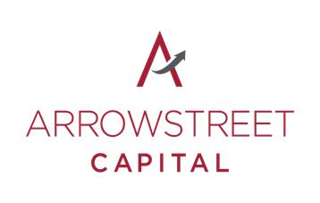

# Data Analyst

#### Technical Skills: Python, SQL, R, AWS, Excel, PowerBI, Tableau, Apache Airflow

## Education 
- M.S., Applied Data Analytics | Boston University Metropolitan College (Expected May 2026)  
- B.S., Business Administration - Finance | Northeastern University (May 2023)

## Work Experience

### Client Operations Co-op @ Arrowstreet Capital LP. (2021)
- Used Microsoft SQL to extract SEDOL identifiers, aligning security data across systems and improving reconciliation accuracy by 25%.
- Standardized naming conventions and automated data validation, boosting reconciliation speed and workflow efficiency by 20%.
- Automated recurring reports and standardized data intake, increasing Client Reporting and Implementation efficiency by 15%.
- Built a dynamic Excel dashboard to streamline reconciliation, cutting handling time by 25% and improving reporting accuracy.

### Marketing Analyst Co-op @ Amazon Global Selling (2020)
- Analyzed weekly new seller metrics in Excel using pivot tables, improving onboarding efficiency by 10%.
- Managed cross-border e-commerce campaigns, boosting new seller acquisition by 15% through targeted social media strategies and A/B testing.
- Wrote two Amazon-style 6-pagers on expanding social media channels and conducting competitor analysis for Amazon Taiwan Global Selling.

## Projects

### Public Transportation Use Tracker | SQL, Tableau
- Designed a SQL database to manage 12,000+ trip records across transportation modes from 500 users. Optimized queries with indexing, sequences, and triggers, and visualized spending patterns and route insights with Tableau [Github](https://github.com/jonathan2018176/Public_Transit_Usage_Tracker/)  

### Credit Card Approval Prediction | Python (NumPy, Pandas, Matplotlib, Seaborn, scikit-learn)
- Processed 1,000+ credit card records using data cleaning, encoding, and scaling. Built a logistic regression model with 85% accuracy and evaluated it with precision, recall, and F1-score. Visualized insights using Matplotlib and Seaborn.  [Github](https://github.com/jonathan2018176/Credit-Card-Approval-Prediction/)

