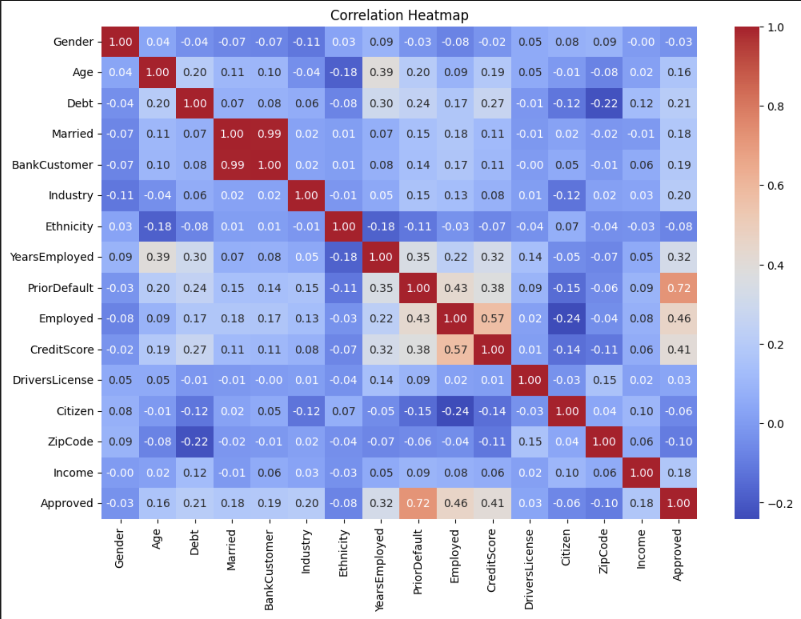
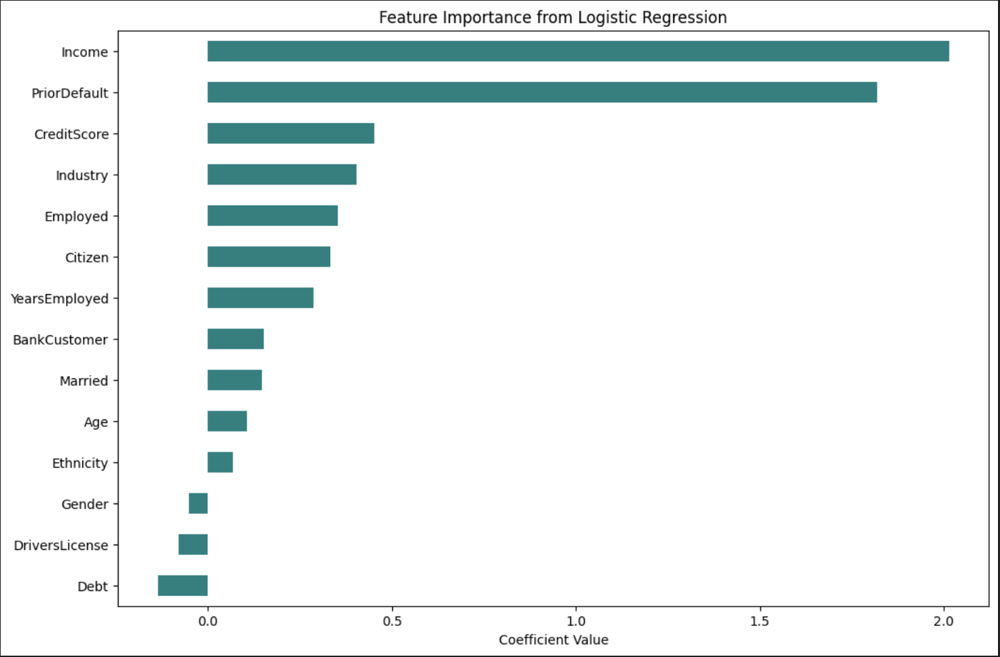

# Data Analyst

#### Technical Skills: Python, SQL, R, AWS, Excel, PowerBI, Tableau, Apache Airflow

### Education 
-M.S., Applied Data Analytics | Boston University Metropolitan College (Expected May 2026)  
-B.S., Business Administration - Finance | Northeastern University (May 2023)

### Work Experience
## Client Operations Co-op @ Arrowstreet Capital LP. (2021)
-Used SQL to match security identifiers across systems, improving accuracy by 25%  
-Automated reporting and data intake processes, reducing manual work by 15%  
-Built Excel dashboard for reconciliation, cutting data handling time by 25%  

## Marketing Analyst Co-op @ Amazon Global Selling (2020)
-Analyzed seller metrics in Excel, boosting onboarding efficiency by 10%  
-Led marketing campaigns that increased seller acquisition by 15%  
-Wrote two strategic reports on channel expansion and competitor analysis  

### Projects
## Public Transportation Use Tracker | SQL, Tableau
-Designed a SQL database to manage 12,000+ trip records across transportation modes from 500 users. Optimized queries with indexing, sequences, and triggers, and visualized spending patterns and route insights with Tableau [Github](https://github.com/jonathan2018176/Public_Transit_Usage_Tracker/)  

## Credit Card Approval Prediction | Python (NumPy, Pandas, Matplotlib, Seaborn, scikit-learn)
-Processed 1,000+ credit card records using data cleaning, encoding, and scaling. Built a logistic regression model with 85% accuracy and evaluated it with precision, recall, and F1-score. Visualized insights using Matplotlib and Seaborn.  [Github](https://github.com/jonathan2018176/Credit-Card-Approval-Prediction/)

